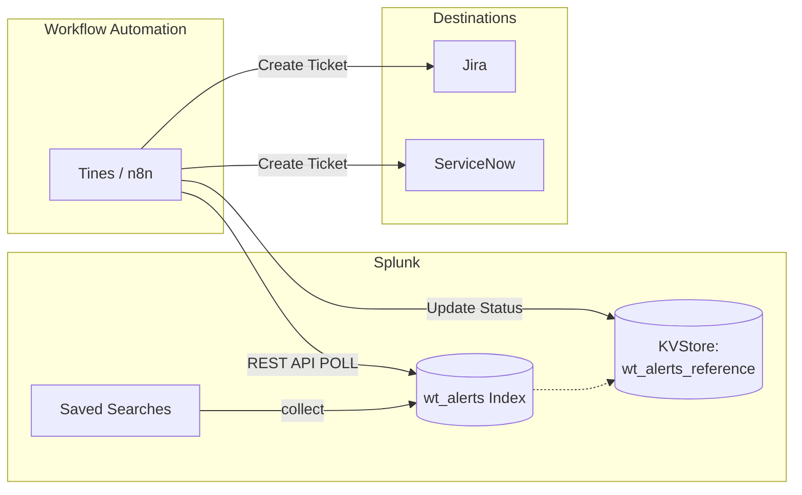

# System Architecture

```mermaid
flowchart LR
    subgraph Splunk
        SPL[Saved Searches] -->|collect| Index[(wt_alerts Index)]
        Index -.-> KV[(KVStore:<br>wt_alerts_reference)]
    end
    
    subgraph Workflow Automation
        Tines[Tines / n8n]
    end
    
    subgraph Destinations
        Jira[Jira]
        SNOW[ServiceNow]
    end

    Tines -->|REST API POLL| Index
    Tines -->|Update Status| KV
    Tines -->|Create Ticket| Jira
    Tines -->|Create Ticket| SNOW
```
