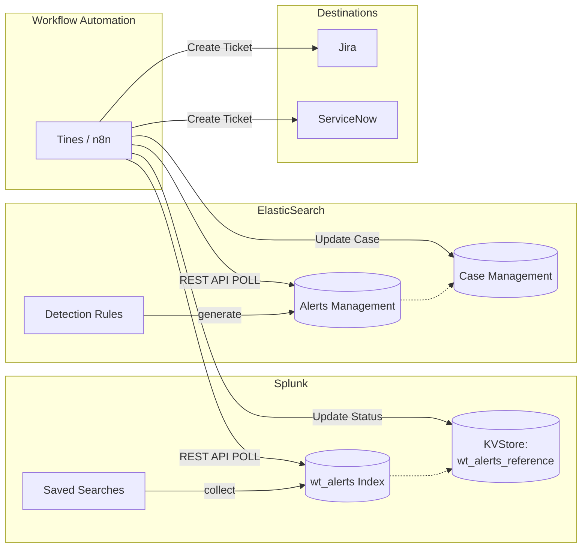

# System Architecture

```mermaid
flowchart LR
    subgraph Splunk
        SplunkRules[Saved Searches] -->|collect| SplunkIndex[(wt_alerts Index)]
        SplunkIndex -.-> KV[(KVStore:<br>wt_alerts_reference)]
    end
    
    subgraph ElasticSearch
        ElasticRules[Detection Rules] -->|generate| ElasticAlerts[(Alerts Management)]
        ElasticAlerts -.-> ElasticCases[(Case Management)]
    end
    
    subgraph Workflow Automation
        Tines[Tines / n8n]
    end
    
    subgraph Destinations
        Jira[Jira]
        SNOW[ServiceNow]
    end

    %% Splunk Interactions
    Tines -->|REST API POLL| SplunkIndex
    Tines -->|Update Status| KV
    
    %% Elastic Interactions
    Tines -->|REST API POLL| ElasticAlerts
    Tines -->|Update Case| ElasticCases
    
    %% Alert Destinations
    Tines -->|Create Ticket| Jira
    Tines -->|Create Ticket| SNOW
```
