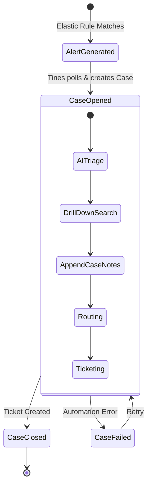

# Elastic Alert Lifecycle

```mermaid
stateDiagram-v2
    [*] --> AlertGenerated: Elastic Rule Matches
    
    AlertGenerated --> CaseOpened: Tines polls & creates Case
    
    state CaseOpened {
        [*] --> AITriage
        AITriage --> DrillDownSearch
        DrillDownSearch --> AppendCaseNotes
        AppendCaseNotes --> Routing
        Routing --> Ticketing
    }
    
    CaseOpened --> CaseClosed: Ticket Created
    CaseOpened --> CaseFailed: Automation Error
    
    CaseFailed --> CaseOpened: Retry
    
    CaseClosed --> [*]
```
