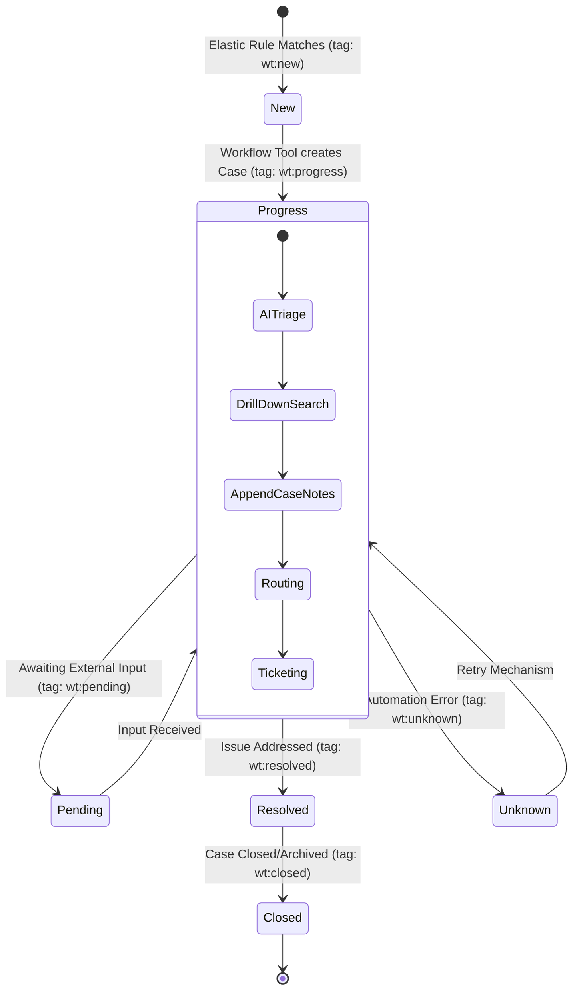

# Elastic Alert Lifecycle

```mermaid
stateDiagram-v2
    [*] --> New: Elastic Rule Matches (tag: wt:new)
    
    New --> Progress: Workflow Tool creates Case (tag: wt:progress)
    
    state Progress {
        [*] --> AITriage
        AITriage --> DrillDownSearch
        DrillDownSearch --> AppendCaseNotes
        AppendCaseNotes --> Routing
        Routing --> Ticketing
    }
    
    Progress --> Pending: Awaiting External Input (tag: wt:pending)
    Progress --> Resolved: Issue Addressed (tag: wt:resolved)
    Pending --> Progress: Input Received
    Resolved --> Closed: Case Closed/Archived (tag: wt:closed)
    
    Progress --> Unknown: Automation Error (tag: wt:unknown)
    Unknown --> Progress: Retry Mechanism
    
    Closed --> [*]
```
