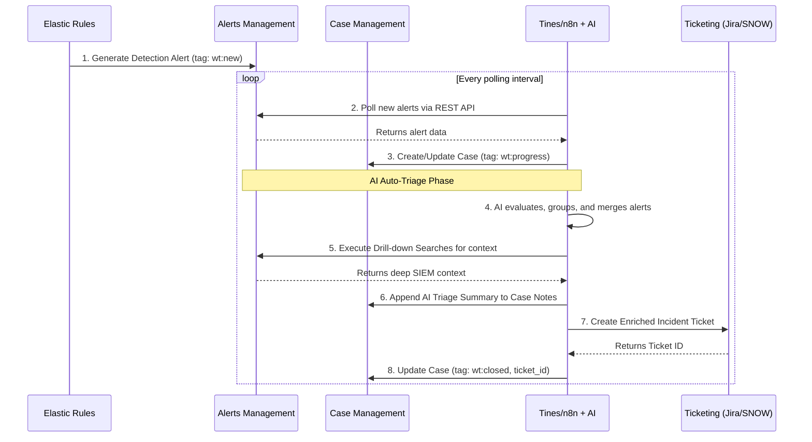

# Elastic Data Flow with AI Triage

```mermaid
sequenceDiagram
    participant E as Elastic Rules
    participant A as Alerts Management
    participant C as Case Management
    participant T as Tines/n8n + AI
    participant D as Ticketing (Jira/SNOW)

    E->>A: 1. Generate Detection Alert (tag: wt:new)
    loop Every polling interval
        T->>A: 2. Poll new alerts via REST API
        A-->>T: Returns alert data
        T->>C: 3. Create/Update Case (tag: wt:progress)
        
        Note over A,T: AI Auto-Triage Phase
        T->>T: 4. AI evaluates, groups, and merges alerts
        T->>A: 5. Execute Drill-down Searches for context
        A-->>T: Returns deep SIEM context
        T->>C: 6. Append AI Triage Summary to Case Notes
        
        T->>D: 7. Create Enriched Incident Ticket
        D-->>T: Returns Ticket ID
        T->>C: 8. Update Case (tag: wt:closed, ticket_id)
    end
```
