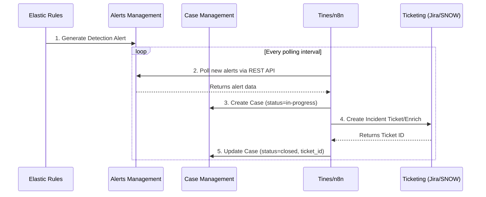

# Elastic Data Flow

```mermaid
sequenceDiagram
    participant E as Elastic Rules
    participant A as Alerts Management
    participant C as Case Management
    participant T as Tines/n8n
    participant D as Ticketing (Jira/SNOW)

    E->>A: 1. Generate Detection Alert
    loop Every polling interval
        T->>A: 2. Poll new alerts via REST API
        A-->>T: Returns alert data
        T->>C: 3. Create Case (status=in-progress)
        T->>D: 4. Create Incident Ticket/Enrich
        D-->>T: Returns Ticket ID
        T->>C: 5. Update Case (status=closed, ticket_id)
    end
```
