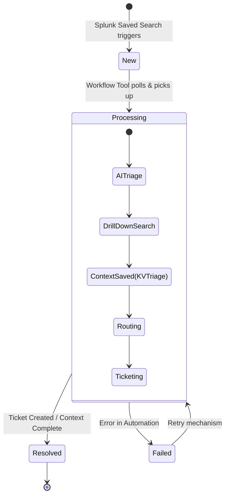

# Splunk Alert Lifecycle

```mermaid
stateDiagram-v2
    [*] --> New: Splunk Saved Search triggers
    
    New --> Processing: Workflow Tool polls & picks up
    
    state Processing {
        [*] --> AITriage
        AITriage --> DrillDownSearch
        DrillDownSearch --> ContextSaved(KVTriage)
        ContextSaved(KVTriage) --> Routing
        Routing --> Ticketing
    }
    
    Processing --> Resolved: Ticket Created / Context Complete
    Processing --> Failed: Error in Automation
    
    Failed --> Processing: Retry mechanism
    
    Resolved --> [*]
```
