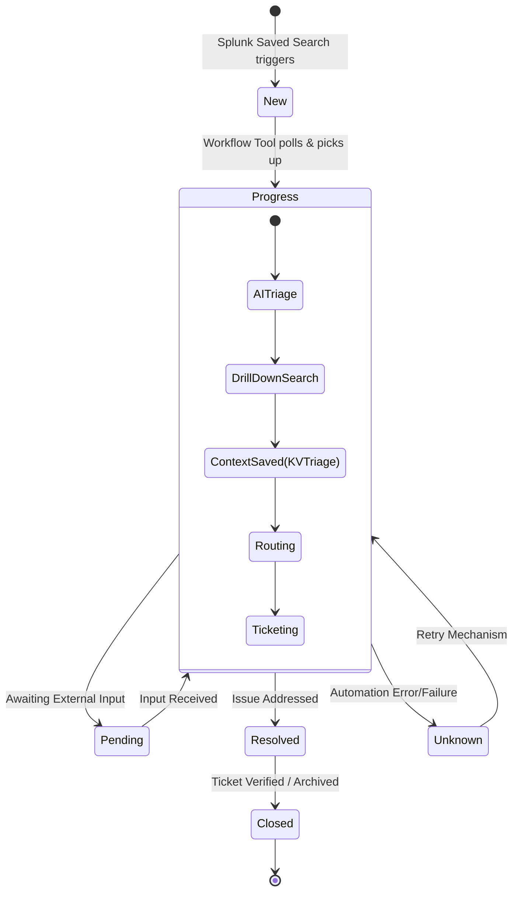

# Splunk Alert Lifecycle

```mermaid
stateDiagram-v2
    [*] --> New: Splunk Saved Search triggers
    
    New --> Progress: Workflow Tool polls & picks up
    
    state Progress {
        [*] --> AITriage
        AITriage --> DrillDownSearch
        DrillDownSearch --> ContextSaved(KVTriage)
        ContextSaved(KVTriage) --> Routing
        Routing --> Ticketing
    }
    
    Progress --> Pending: Awaiting External Input
    Progress --> Resolved: Issue Addressed
    Pending --> Progress: Input Received
    Resolved --> Closed: Ticket Verified / Archived
    
    Progress --> Unknown: Automation Error/Failure
    Unknown --> Progress: Retry Mechanism
    
    Closed --> [*]
```
