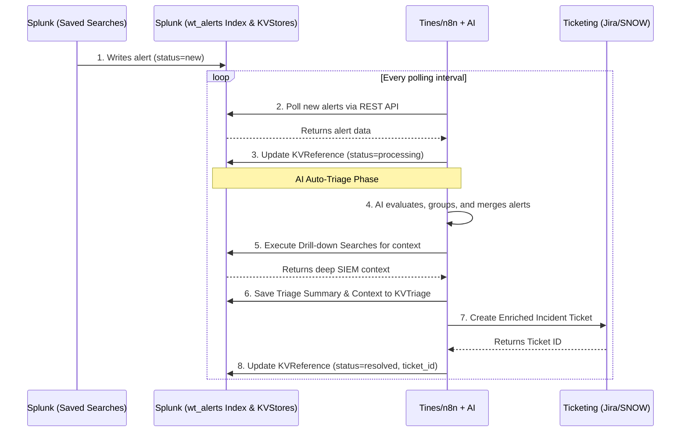

# Splunk Data Flow with AI Triage

```mermaid
sequenceDiagram
    participant S as Splunk (Saved Searches)
    participant W as Splunk (wt_alerts Index & KVStores)
    participant T as Tines/n8n + AI
    participant D as Ticketing (Jira/SNOW)

    S->>W: 1. Writes alert (status=new)
    loop Every polling interval
        T->>W: 2. Poll new alerts via REST API
        W-->>T: Returns alert data
        T->>W: 3. Update KVReference (status=processing)
        
        Note over W,T: AI Auto-Triage Phase
        T->>T: 4. AI evaluates, groups, and merges alerts
        T->>W: 5. Execute Drill-down Searches for context
        W-->>T: Returns deep SIEM context
        T->>W: 6. Save Triage Summary & Context to KVTriage
        
        T->>D: 7. Create Enriched Incident Ticket
        D-->>T: Returns Ticket ID
        T->>W: 8. Update KVReference (status=resolved, ticket_id)
    end
```
