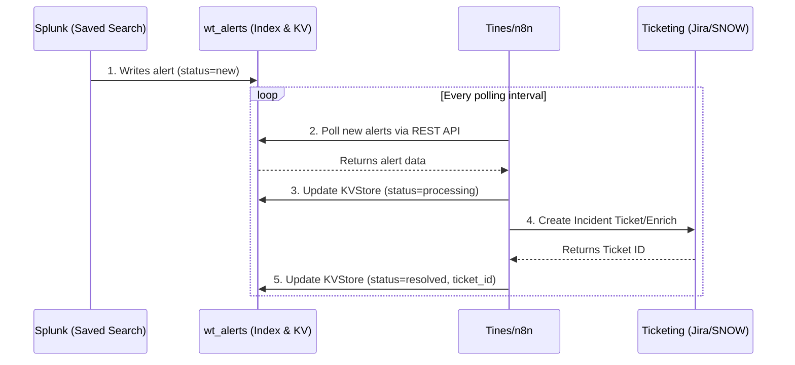

# Data Flow

```mermaid
sequenceDiagram
    participant S as Splunk (Saved Search)
    participant W as wt_alerts (Index & KV)
    participant T as Tines/n8n
    participant D as Ticketing (Jira/SNOW)

    S->>W: 1. Writes alert (status=new)
    loop Every polling interval
        T->>W: 2. Poll new alerts via REST API
        W-->>T: Returns alert data
        T->>W: 3. Update KVStore (status=processing)
        T->>D: 4. Create Incident Ticket/Enrich
        D-->>T: Returns Ticket ID
        T->>W: 5. Update KVStore (status=resolved, ticket_id)
    end
```
